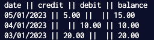

# Bank Tech Test

This is a tech test which I have completed in order to improve my ability to convert a set of requirements into a fully interactive and well-tested application. 

This project was completed using Python, and the tests were written using Pytest.

## Requirements

* You should be able to interact with your code via a REPL like IRB or Node. (You don't need to implement a command line interface that takes input from STDIN.)
* Deposits, withdrawal.
* Account statement (date, amount, balance) printing.
* Data can be kept in memory (it doesn't need to be stored to a database or anything).

Acceptance criteria
* Given a client makes a deposit of 1000 on 10-01-2023
* And a deposit of 2000 on 13-01-2023
* And a withdrawal of 500 on 14-01-2023
* When she prints her bank statement
* Then she would see

date || credit || debit || balance
14/01/2023 || || 500.00 || 2500.00
13/01/2023 || 2000.00 || || 3000.00
10/01/2023 || 1000.00 || || 1000.00
## Usage
* Clone this repo, to ensure you have the files saved to your system
* Change into the correct directory, and make a new python file
```bash
# Include this at the top of your file to import the code
from bank import BankAccount, InsufficientBalance, MaximumDeposit

# Create a bank account, and make deposits & withdrawals
my_bank_account = BankAccount()
my_bank_account.deposit(20, "03/01/2023")
my_bank_account.withdraw(10, "04/01/2023")
my_bank_account.deposit(5, "05/01/2023")

# Get your bank statement
print(my_bank_account.get_statement())
```
Run the file to see your bank statement in the terminal

## Testing
Make sure you are in the directory that contains the "test_bank.py" file, then type the following commands into your terminal
```bash
#Install pytest
pip install pytest

# Run tests
pytest
```